# Cloud-Native Infrastructure for Telecommunications Site Acceptance & Inspection

An enterprise-grade, cloud-native image validation and storage platform designed to streamline remote quality assurance and site acceptance for telecommunications infrastructure deployments.

---

## I- Project Overview & Real-World Scenario

In this project based on a real-world scenario, I acted as a **Cloud & Specialist**. My mission was to design and build a secure, reliable, and scalable cloud platform to solve a critical operational bottleneck in telecommunications infrastructure rollouts.

### The Business Challenge
During the installation and modernization of cellular sites (macro sites, small cells, and fiber hubs), field technicians must document their work to obtain **Site Acceptance** from the client. Traditionally, sending installation photos via email or messaging apps led to lost files, unindexed data, and massive delays in verification. 

The business required a centralized platform where field teams could upload high-resolution evidence directly from the field for immediate remote engineering review, focusing on critical telecommunications check-points:
* **Antenna Alignment & Tilts:** Confirming exact azimuth, mechanical tilt, and electrical tilt orientations.
* **RF Connectors & Weatherproofing:** Inspecting coaxial jumper connections and the quality of waterproofing kits (gel wraps/tape) to prevent water ingress.
* **Equipment Grounding:** Verifying structural grounding bars, RF surge arrestors, and green/yellow grounding copper wires.
* **Cabinet & RRU Layout:** Validating the neatness of cable management, fiber optic patching, Remote Radio Units (RRUs) mounting, and power distribution wiring.

---

## II- Solution Architecture & Component Roles

Instead of relying on manual server setups, I architected a decoupled, secure network environment on AWS where each component has a specific structural role to fulfill the uptime requirements of field operations.

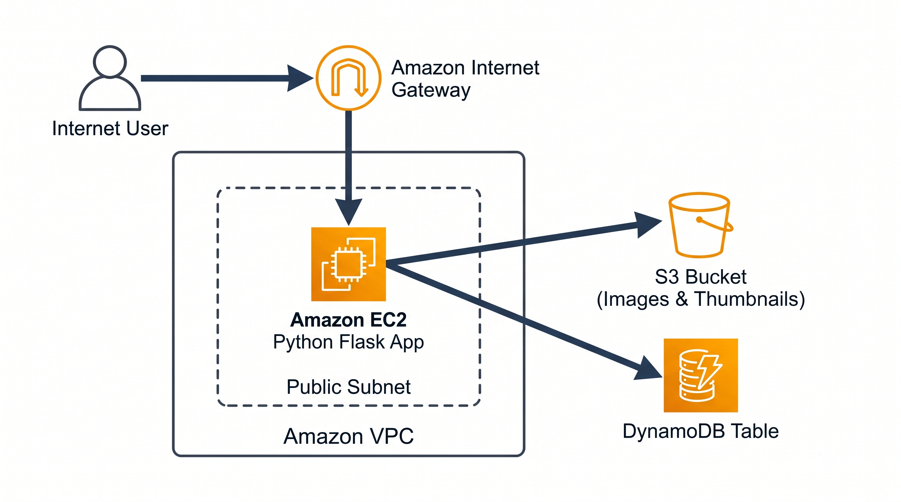

### 1. Network & Security Isolation (VPC & Security Groups)
* **Role:** Establishes an isolated perimeter. Traffic from the public internet enters via an **Internet Gateway (IGW)** into a custom **Public Subnet**. 
* **Security Routing:** A stateful **Security Group** acts as a firewall, strictly filtering inbound traffic to allow only web requests on Port 80 and Port 5000, blocking all unauthorized network probing.

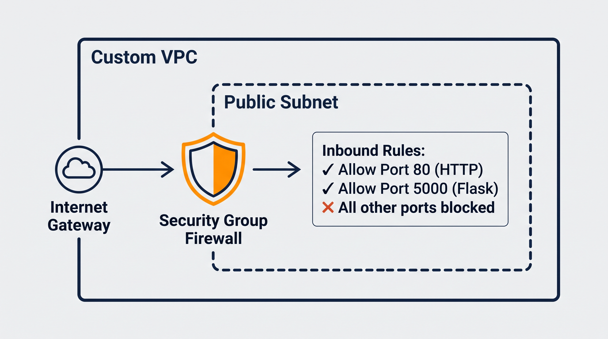
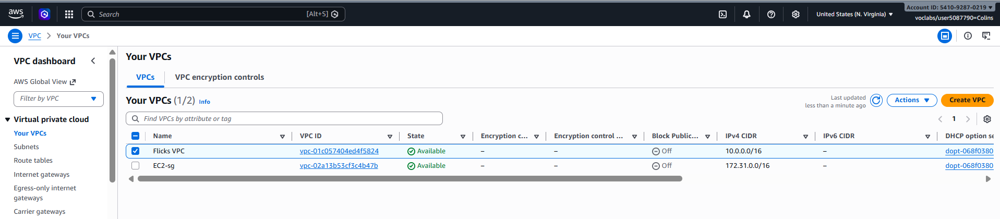

### 2. Compute Layer (EC2 & Python Flask)
* **Role:** Serves as the application backend. It runs a **Python Flask** server hosted on an **Amazon EC2** instance (Amazon Linux 2).
* **Processing Logic:** When a technician uploads a site inspection photo, the backend uses the **Pillow (PIL)** library to process the image and dynamically generate a lightweight **120x120px thumbnail** to optimize mobile data consumption for reviewers checking sites on the move.

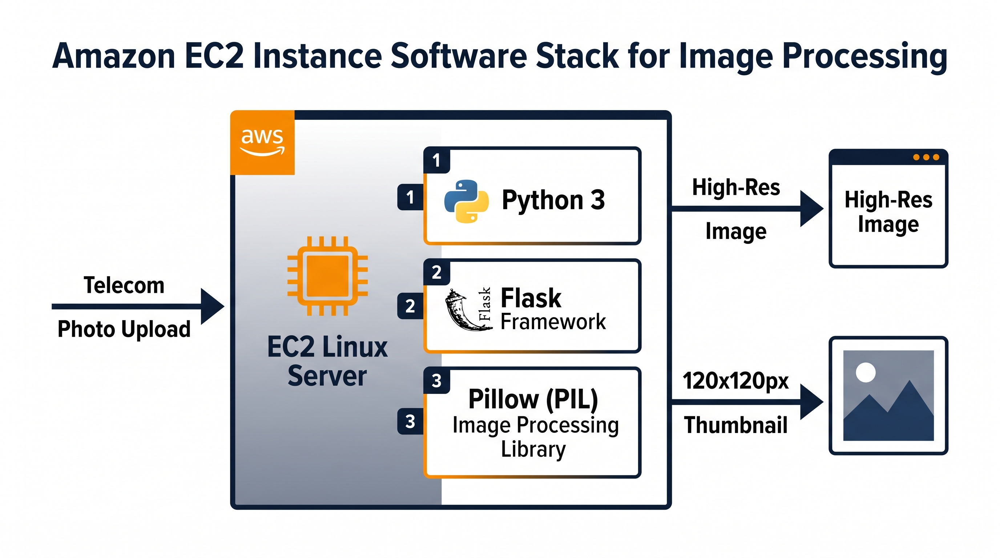
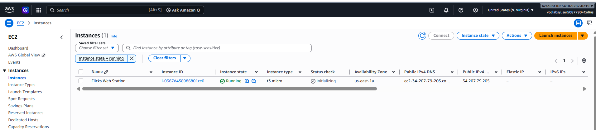

### 3. Object Storage Layer (Amazon S3)
* **Role:** Reliable, low-cost structural storage. High-resolution photos and thumbnails are saved permanently in an **Amazon S3 Bucket**.
* **Access Control:** The bucket is configured with explicit **Cross-Origin Resource Sharing (CORS)** rules and an IAM Bucket Policy allowing safe, public read permissions (`s3:GetObject`) so clients can review images instantly.

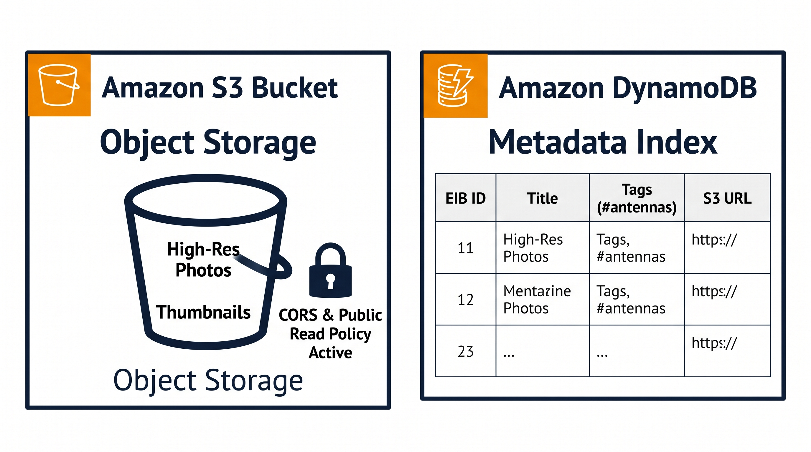
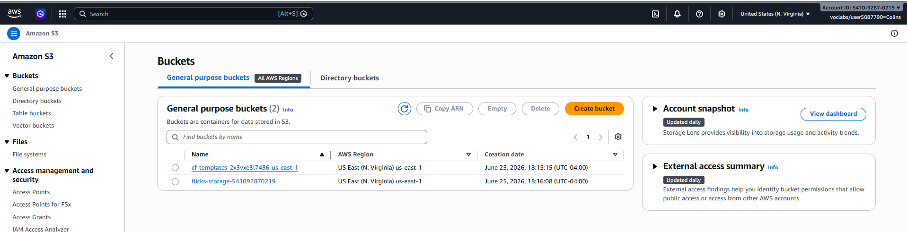

### 4. Metadata Indexing (Amazon DynamoDB)
* **Role:** Fast lookup table. An **Amazon DynamoDB** NoSQL database stores metadata for each telecom site inspection (Unique EIB tracking ID, Site Title, Technical Tags like `#antennas` or `#waterproofing`, and the direct S3 URLs). This ensures instantaneous searching without heavy relational database overhead.

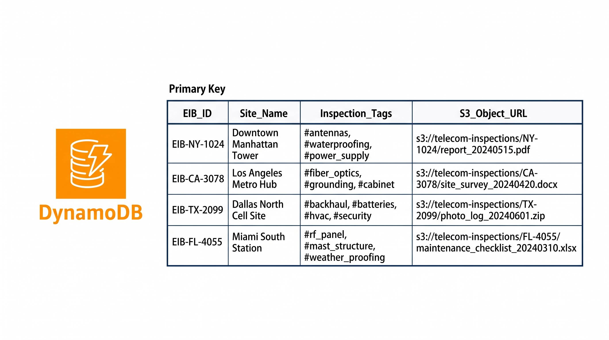
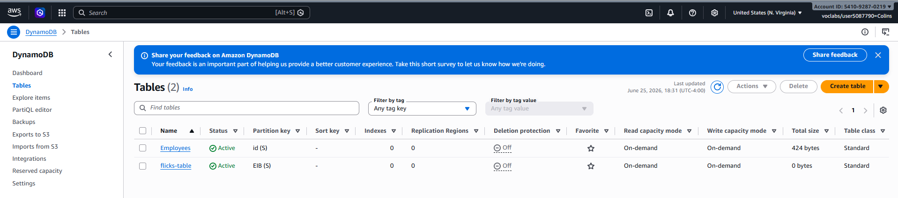

---

## III- Real-World Engineering Challenges & Troubleshooting

Deploying production environments always reveals subtle integration challenges. Below are the two critical engineering problems I diagnosed and resolved during this project:

### 1. Storage Service Optimization: Resolving Object Metadata Misconfigurations (S3 Inline vs. Forced Download)
* **The Cloud Challenge:** During the integration phase with Amazon S3, clicking an inspection thumbnail triggered an unexpected automatic file download instead of opening inline in a new browser tab. The application logic was sound, but the interaction with the AWS storage layer was unoptimized.
* **The Root Cause:** By default, the AWS Boto3 SDK's `upload_file()` API uploads objects with a generic `Content-Type` metadata header set to `binary/octet-stream`. Amazon S3 serves this header directly to browsers, which interpret it as an anonymous binary stream and force a download for safety. 
* **The Cloud Resolution:** As a Cloud Specialist, I intercepted this behavior by reconfiguring the storage upload parameters. I implemented an environment-level extension mapping that dynamically injects the precise system MIME types (e.g., `image/png`, `image/jpeg`) into the Amazon S3 object metadata using the `ExtraArgs={'ContentType': content_type}` parameters. This aligned the cloud storage delivery with web standards, enabling native browser rendering for the client.

### 2. Infrastructure as Code (IaC) State Management: Resolving CloudFormation Resource Locks
* **The Cloud Challenge:** During iterative stack updates, the automated deployment pipeline abruptly failed, entering a `ROLLBACK_IN_PROGRESS` state with a critical resource collision error: `"flicks-storage-... already exists"`.
* **The Root Cause:** This is a fundamental behavior of AWS CloudFormation's data protection guardrails. CloudFormation refuses to delete or overwrite an Amazon S3 bucket if it contains persistent objects (in this case, active telecom inspection photos uploaded during testing), causing a state conflict during automated redeployments.
* **The Cloud Resolution:** I performed cloud state troubleshooting by isolating the resource lock. I securely initiated an intentional object purge and empty sequence on the persistent S3 bucket directly via the AWS Management Console to clear the underlying infrastructure state. This resolved the resource collision and allowed the CloudFormation template to execute a flawless, automated deployment loop.

---

## IV- Automated Infrastructure as Code (IaC) Script

To ensure this entire environment can be deployed in under 5 minutes across any AWS region without human error, the entire blueprint has been written as an **AWS CloudFormation template**.

The complete automation script is available in this repository: [template.yaml](./template.yaml).

### How to Deploy:
1. Navigate to **CloudFormation** in the AWS Console.
2. Click **Create Stack** and upload the `template.yaml` file.
3. Provide a stack name (e.g., `telecom-flicks-stack`) and acknowledge IAM capabilities.
4. Once `CREATE_COMPLETE` is achieved, go to the **Outputs** tab and click the `PublicWebApplicationURL` to open the platform.

---

## V- Application Interface Demonstrations

Below are the live dashboard interfaces accessed by the telecommunications field technicians and remote review engineers.

### 1. Main Inspection Dashboard (Home Page)
The main hub displaying registered telecom sites with their associated metadata tags, status tracking, and optimized thumbnails.
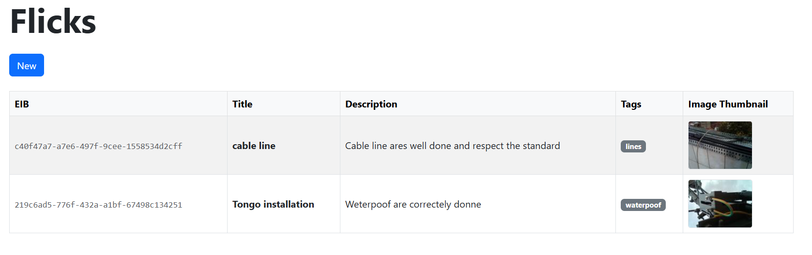

### 2. Site Record & Photo Registration Page
The production form used by field engineers to register new infrastructure milestones, assign precise technical tags, and stream media assets directly to AWS.
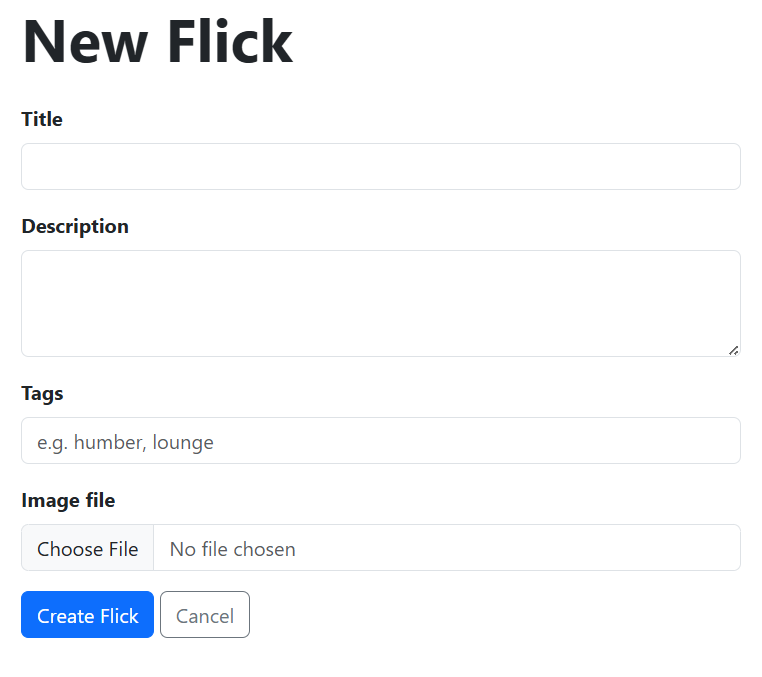

---

## VI Technical Stack
* **Cloud Platform:** AWS (VPC, EC2, S3, DynamoDB, CloudFormation, IAM)
* **Core Languages:** Python 3 (Flask, Boto3 SDK, Pillow, Werkzeug), HTML5, Bootstrap 5
* **Domain Focus:** Telecommunications Quality Assurance & Automation
